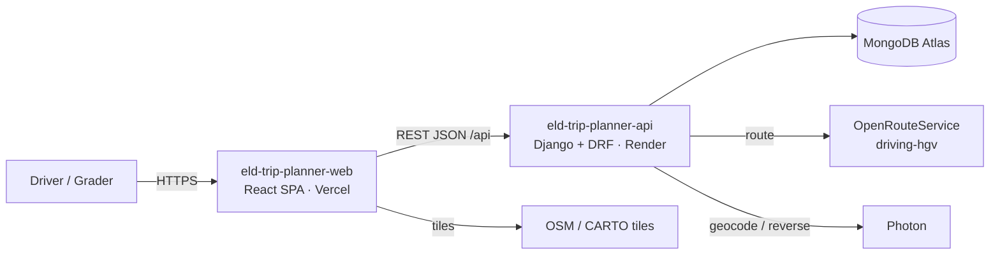
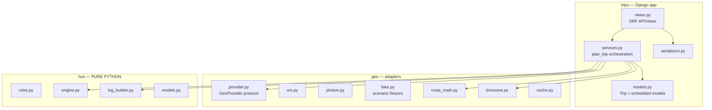
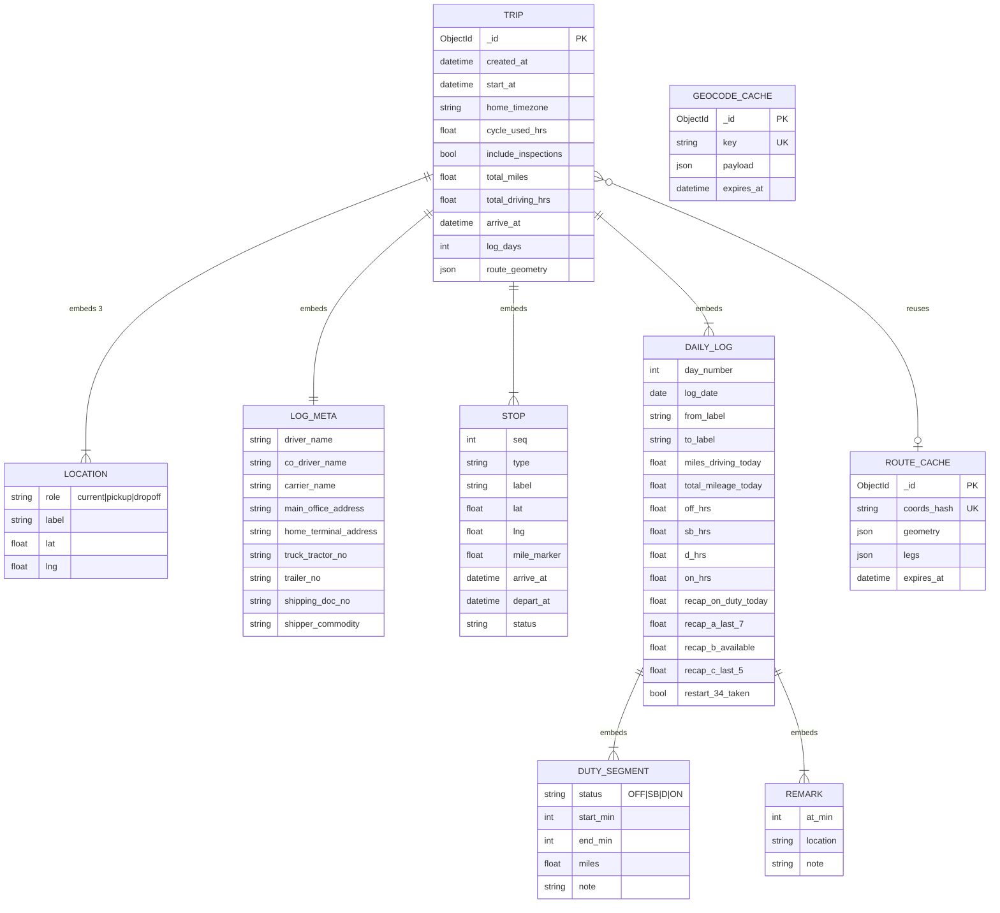

# 02 — Architecture (API)

## 1. Decisions at a glance

| Area | Decision | Rationale |
|---|---|---|
| Repo strategy | **Two repos**: `eld-trip-planner-api` (this) and `eld-trip-planner-web` | Independent deploy targets (Render / Vercel), clean ownership, each repo readable on its own by graders |
| Framework | **Django 5.2 LTS + Django REST Framework** | Required by brief; 5.2 LTS matches `django-mongodb-backend` 5.2.x |
| Database | **MongoDB Atlas (M0 free)** via official **`django-mongodb-backend` ≥ 5.2.1, < 5.3** | A trip plan is one document read/written whole; embedded models fit naturally |
| HOS logic | **Pure-Python package `hos/`** (no Django imports) | Fast deterministic TDD; easy to explain in the Loom |
| Routing | **OpenRouteService** `driving-hgv` (free key) | Truck profile; key stays server-side; cached |
| Geocoding | **Photon** (komoot, OSM-based), proxied + cached | Free, no key |
| Time zones | `timezonefinder` + `zoneinfo` | Offline home-terminal zone lookup |
| API schema | **drf-spectacular** → committed `openapi.yaml` | Machine-readable contract the web repo generates TS types from |
| Tests | pytest, pytest-django, Hypothesis, respx | TDD inner loop + property tests |
| Hosting | **Render Web Service** (Python runtime, gunicorn), configured in the dashboard | Chosen platform; long-running process suits Django + Mongo connection pooling |
| CI | GitHub Actions: ruff → pytest (Mongo service) → contract drift check | Render auto-deploys `main` after checks pass. ⏭️ Deferred for now (03 *Decision log*) |

## 2. System context



## 3. Module boundaries



`hos/` imports only the standard library. `geo/` uses `httpx` but no Django models (cache access goes through a small
repository interface). `trips/services.py` is the only place that wires everything together.

## 4. Request flow — `POST /api/trips/`

1. **Validate** (serializer): three locations (label + lat/lng), `cycle_used_hrs` 0–70 step 0.25, optional start time, tz, flags, log meta.
2. **Resolve time zone** (A-11): request value, else `timezonefinder` on the current location.
3. **Route**: `GeoProvider.route([current, pickup, dropoff])` → 2 legs (mi, h, geometry). Cached by coordinate hash.
4. **Plan**: `hos.engine.plan_timeline(TripInput)` → `Segment`s + `Stop`s with `mile_marker`.
5. **Place stops**: `route_math.point_at_mile(geometry, mile_marker)` → lat/lng; batch **reverse-geocode** → "City, ST" (cached).
6. **Build logs**: `hos.log_builder.build_daily_logs(...)` → `DailyLog`s (clipped segments, totals, remarks, header, recap).
7. **Persist** the `Trip` document; return `TripResponse`.

### 4.1 HOS engine (`hos/engine.py`)

- **Units:** integer minutes from trip start; miles as float.
- **State:** `t`, `shift_start`, `drive_in_shift`, `drive_since_break`, `cycle_used`, `miles_since_fuel`, `non_driving_streak`, `off_streak`.
- **Derived resets** (business rules §4): non-driving streak ≥ 30 → `drive_since_break = 0`; OFF/SB streak ≥ 600 → new shift;
  OFF/SB streak ≥ 2040 → `cycle_used = 0`.

```python
Q = 15  # minutes

def drive_leg(s: State, leg: Leg) -> None:
    remaining = ceil_q(leg.duration_min)                        # A-08
    while remaining > 0:
        s.start_shift_if_needed()
        limits = {
            "leg":   remaining,
            "fuel":  floor_q(minutes_for(1000 - s.miles_since_fuel, leg.mph)),  # R-06, A-09
            "break": 8*60  - s.drive_since_break,               # R-03
            "11":    11*60 - s.drive_in_shift,                  # R-01
            "14":    14*60 - s.minutes_since_shift_start(),     # R-02
            "70":    70*60 - s.cycle_used,                      # R-04
        }
        chunk = max(0, min(limits.values()))
        if chunk:
            remaining -= s.drive(chunk, leg)
        hit = {k for k, v in limits.items() if v <= chunk}
        if "leg" in hit and remaining == 0:
            return
        s.resolve(hit)   # A-12: fuel first if due, then the single longest rest (34h > 10h > 30m)

def plan_timeline(trip: TripInput) -> Timeline:
    s = State.from_input(trip)
    if s.cycle_used >= 70*60: s.off(34*60, "34-hr restart")     # A-05
    if trip.inspections: s.on(15, "Pre-trip inspection")         # A-06
    drive_leg(s, trip.legs[0]); s.on(60, "Pickup")               # R-07
    drive_leg(s, trip.legs[1]); s.on(60, "Dropoff")              # ON allowed past 14th hr / 70
    if trip.inspections: s.on(15, "Post-trip inspection")
    return s.timeline
```

**Invariants** (Hypothesis property tests): never driving when `drive_in_shift > 660`, `minutes_since_shift_start > 840`,
`drive_since_break > 480`, `cycle_used > 4200` or `miles_since_fuel > 1000`; boundaries `% 15 == 0`; contiguous segments.

### 4.2 Log builder (`hos/log_builder.py`)

1. Trip minutes → aware datetimes in home tz.
2. Pad OFF from local midnight before start and to local midnight after end.
3. Split at each local midnight; per-day `start_min/end_min` = minutes since that midnight (0–1440).
4. Totals per status (hours, 2 dp); assert sum == 24.00.
5. Remarks: one per status change — time, "City, ST", note.
6. Header: date, from/to, miles driving today, total mileage today, meta fields.
7. Recap (R-12, A-14): on-duty today; A (last 7 incl. today); B = max(0, 70 − A); C (last 5); `restart_34_taken`.

## 5. API contract (shared with the web repo)

Base path `/api`. JSON. CORS limited to the web origins. Errors always:
`{"error": {"code": str, "message": str, "fields": {name: [msg]}}}`.

| Method | Path | Purpose | Success |
|---|---|---|---|
| `GET` | `/api/health/` | Liveness + Mongo ping (also used to wake Render) | `200 {"status":"ok"}` |
| `GET` | `/api/geocode/?q=` | Autocomplete (≥ 3 chars) | `200 [{label, lat, lng}]` |
| `POST` | `/api/trips/` | Plan a trip | `201 TripResponse` |
| `GET` | `/api/trips/{id}/` | Retrieve a saved trip | `200 TripResponse` |
| `GET` | `/api/schema/` | OpenAPI 3 schema | `200` |

**Error codes:** `VALIDATION_ERROR` 400 · `NOT_FOUND` 404 · `ROUTE_NOT_FOUND` 422 · `PROVIDER_UNAVAILABLE` 502.

**Request**

```json
{
  "current":  { "label": "Richmond, VA",    "lat": 37.5407, "lng": -77.4360 },
  "pickup":   { "label": "Baltimore, MD",   "lat": 39.2904, "lng": -76.6122 },
  "dropoff":  { "label": "Kansas City, MO", "lat": 39.0997, "lng": -94.5786 },
  "cycle_used_hrs": 20,
  "start_time": "2026-09-24T06:00",
  "home_timezone": "America/New_York",
  "include_inspections": true,
  "log_meta": {
    "driver_name": "John Doe", "co_driver_name": "",
    "carrier_name": "John Doe's Transportation", "main_office_address": "Washington, D.C.",
    "home_terminal_address": "Richmond, VA", "truck_tractor_no": "123", "trailer_no": "456",
    "shipping_doc_no": "BOL-10001", "shipper_commodity": "ACME Co. — paper products"
  }
}
```

Only `current`, `pickup`, `dropoff`, `cycle_used_hrs` are required.

**`TripResponse`** (values from the `SC-2` fake fixture: legs 120 mi + 1,080 mi)

```json
{
  "id": "66f1…",
  "inputs": { "...echo of request with defaults applied..." },
  "summary": {
    "total_miles": 1200.0, "total_driving_hrs": 20.0, "total_on_duty_hrs": 23.0,
    "start_at": "2026-09-24T06:00:00-04:00", "arrive_at": "2026-09-25T14:15:00-04:00",
    "end_at": "2026-09-25T15:30:00-04:00", "log_days": 2, "stop_count": 5,
    "cycle_used_end_hrs": 43.0, "home_timezone": "America/New_York"
  },
  "route": {
    "geometry": { "type": "LineString", "coordinates": [[-77.43, 37.54], "..."] },
    "legs": [ { "from": "current", "to": "pickup", "distance_mi": 120.0, "duration_hrs": 2.0 } ]
  },
  "stops": [
    { "seq": 1, "type": "pickup", "label": "Baltimore, MD", "lat": 39.29, "lng": -76.61,
      "mile_marker": 120.0, "arrive_at": "…", "depart_at": "…", "duration_min": 60, "status": "ON" }
  ],
  "daily_logs": [
    {
      "day_number": 1, "date": "2026-09-24",
      "header": { "from": "Richmond, VA", "to": "near Dayton, OH",
                  "miles_driving_today": 660.0, "total_mileage_today": 660.0,
                  "carrier_name": "…", "main_office_address": "…", "home_terminal_address": "…",
                  "truck_tractor_no": "123", "trailer_no": "456",
                  "shipping_doc_no": "BOL-10001", "shipper_commodity": "…" },
      "segments": [ { "status": "OFF", "start_min": 0, "end_min": 360 },
                    { "status": "ON", "start_min": 360, "end_min": 375, "note": "Pre-trip inspection" } ],
      "totals": { "OFF": 6.5, "SB": 5.25, "D": 11.0, "ON": 1.25 },
      "remarks": [ { "at_min": 360, "location": "Richmond, VA", "note": "Pre-trip inspection" } ],
      "recap": { "on_duty_today": 12.25, "a_last_7": 32.25, "b_available_tomorrow": 37.75,
                 "c_last_5": 32.25, "restart_34_taken": false }
    }
  ]
}
```

`stop.type` ∈ `pickup | fuel | break_30 | rest_10 | restart_34 | dropoff`. Pre/post-trip inspections are not map stops;
they appear only in the log segments and remarks. `summary.stop_count == len(stops)`.

### 5.1 Contract artifacts (how the web repo stays in sync)

| Artifact | Generated by | Consumed by web repo |
|---|---|---|
| `openapi.yaml` (committed) | `manage.py spectacular --file openapi.yaml` | `npm run gen:api-types` → `src/lib/api/schema.d.ts` (openapi-typescript) |
| `tests/fixtures/responses/sc1…sc7.json` (committed) | `manage.py dump_scenarios` (fake provider, fixed start time) | `npm run sync-contract` → MSW handlers + Playwright expectations |

CI fails if either artifact is stale (`git diff --exit-code` after regenerating). Contract changes are committed with
`contract:` in the message; breaking ones with `BREAKING:`.

## 6. Data model (MongoDB)

Collections: **`trips`**, **`route_cache`**, **`geocode_cache`**. Everything else is embedded
(`EmbeddedModel` + `EmbeddedModelField` / `EmbeddedModelArrayField`).



Indexes: unique `coords_hash`, unique `key`, **TTL on `expires_at`** — created by `manage.py ensure_indexes` (PyMongo),
run as part of the Render **pre-deploy / build** step.

**Settings notes** (`django-mongodb-backend` ≥ 5.2.1, full file in `06-project-setup.md` §5):
`DATABASES["default"] = {"ENGINE": "django_mongodb_backend", "HOST": MONGODB_URI, "NAME": MONGODB_DB}` (connection string in
`HOST`; `parse_uri()` is deprecated); `DEFAULT_AUTO_FIELD = "django_mongodb_backend.fields.ObjectIdAutoField"`;
`DATABASE_ROUTERS = ["django_mongodb_backend.routers.MongoRouter"]` (needed for embedded models);
`"django_mongodb_backend"` in `INSTALLED_APPS`; remove `default_auto_field = BigAutoField` from `trips/apps.py` (5.2.x);
minimal `INSTALLED_APPS` (no admin/auth); DRF `DEFAULT_AUTHENTICATION_CLASSES = []`, `UNAUTHENTICATED_USER = None`.

## 7. Deployment — Render

The service is configured in the Render dashboard (no `render.yaml` Blueprint; see `03-implementation-plan.md` *Decision log*).
Render builds and deploys on every push to `main`.

| Setting | Value |
|---|---|
| Service | `eld-trip-planner-api` · Python · free plan · https://eld-trip-planner-api-ozav.onrender.com |
| Build command | `pip install -r requirements.txt && python manage.py ensure_indexes` |
| Start command | `gunicorn config.wsgi:application --bind 0.0.0.0:$PORT --workers 2 --timeout 90` |
| Health check path | `/api/health/` |
| Env vars | `PYTHON_VERSION=3.12.7`, `DJANGO_SECRET_KEY` (random), `DJANGO_DEBUG=0`, `ALLOWED_HOSTS=.onrender.com`, `GEO_PROVIDER=fake` (→ `live` in A10), `MONGODB_URI` (secret), `MONGODB_DB=eld`, `ORS_API_KEY` (A10), `CORS_ALLOWED_ORIGINS`, `CORS_ALLOWED_ORIGIN_REGEXES` (§8) |

- `requirements.txt` is exported from `uv.lock` (`uv export --no-dev --no-hashes`); CI fails if it drifts.
- `gunicorn` is a runtime dependency. No static files (API only), so no WhiteNoise needed.
- Mongo client is created once per process and reused.
- Atlas **Network Access**: `0.0.0.0/0` (Render free instances have no static outbound IP) + a dedicated DB user.
- Auto-deploy `main` only after GitHub checks pass.

### 7.1 Render free-tier cold starts

Free web services **spin down after 15 minutes without traffic** and take about **a minute** to spin back up; each
workspace gets 750 free instance hours per month (enough for one service running continuously).

| Mitigation | Owner |
|---|---|
| Web app calls `GET /api/health/` on first load and shows "Waking up the server…" if it takes > 3 s (AC-46) | web |
| Client timeout for `POST /api/trips/` ≥ 90 s during wake-up; retry once on 502/503 | web |
| Uptime pinger (e.g. cron-job.org / UptimeRobot) hitting `/api/health/` every 10 min during the grading window | ops |
| Optional: switch plan to Starter while graders are testing | ops |
| `@smoke` E2E warms the API before asserting | web |

## 8. Environment variables

| Var | Example |
|---|---|
| `DJANGO_SECRET_KEY` | generated |
| `DJANGO_DEBUG` | `1` locally, `0` on Render |
| `ALLOWED_HOSTS` | `localhost,127.0.0.1` / `.onrender.com` |
| `MONGODB_URI` | Atlas SRV URI, required in every environment (no local MongoDB) |
| `MONGODB_DB` | `eld` on Render · `eld_dev` locally · `eld_e2e` for E2E · `eld_ci` in CI (pytest-django adds a `test_` prefix) |
| `GEO_PROVIDER` | `fake` (default locally, tests, E2E) · `live` (Render) |
| `ORS_API_KEY` | — |
| `PHOTON_URL` | `https://photon.komoot.io` |
| `CORS_ALLOWED_ORIGINS` | `http://localhost:5173,https://<app>.vercel.app` |
| `CORS_ALLOWED_ORIGIN_REGEXES` | Vercel preview pattern |

## 9. Risks & mitigations

| Risk | Mitigation |
|---|---|
| Contract drift between repos | Committed `openapi.yaml` + response fixtures; CI staleness check; web `api-contract.spec.ts`; `contract:` commit tag |
| Render cold start (~1 min) | §7.1 |
| Free API rate limits | Mongo caches with TTL; fake provider in all tests; debounce autocomplete in web |
| Many reverse-geocodes on long trips | Batch + cache; fallback "near <nearest place>" |
| Time-zone / DST bugs | UTC storage; tz conversion only in log builder; explicit tests |
| Rounding drift | Integer minutes; `% 15 == 0` invariant |
| `django-mongodb-backend` gaps | Simple models, embedded docs, no joins, PyMongo for indexes |
